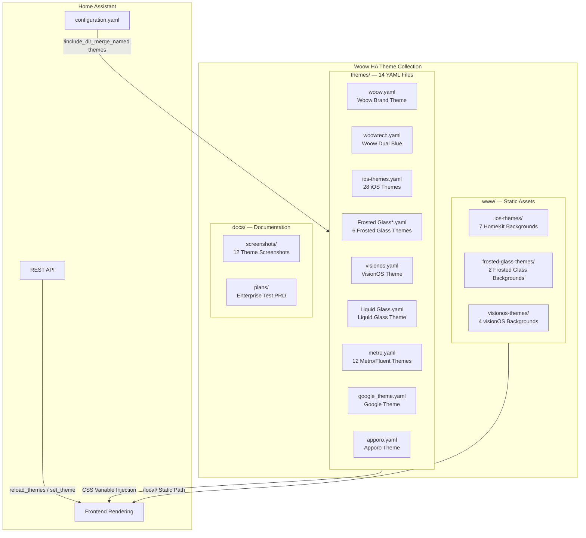
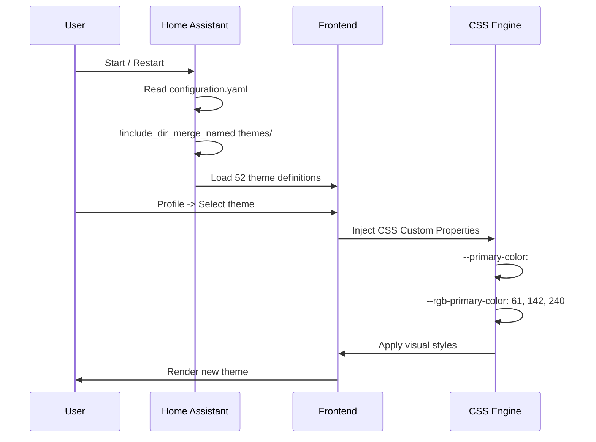
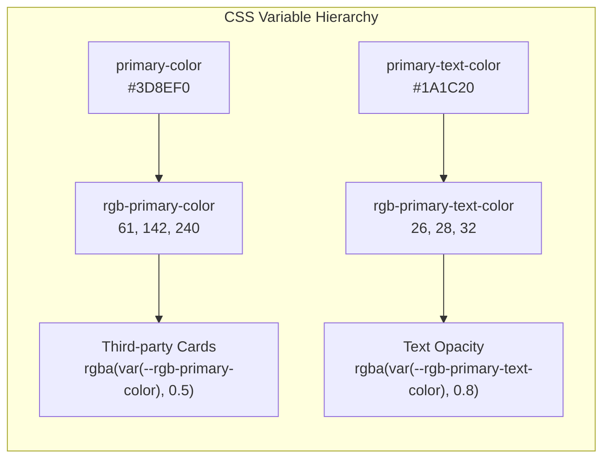
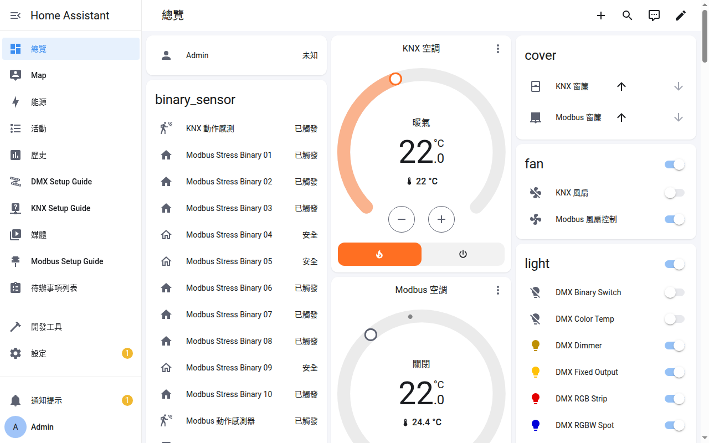
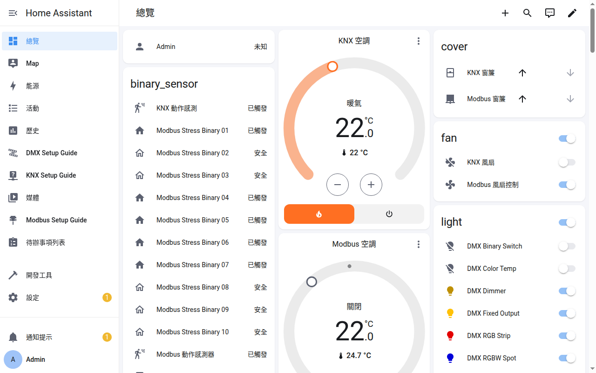
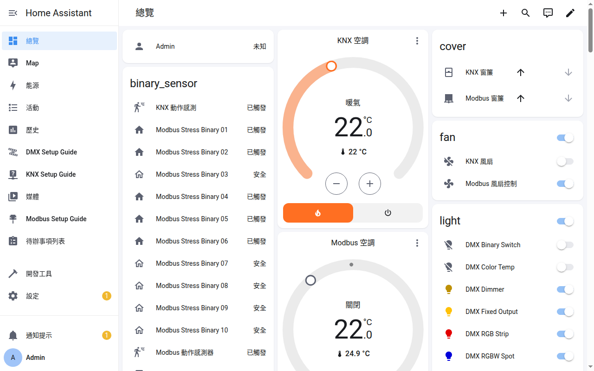
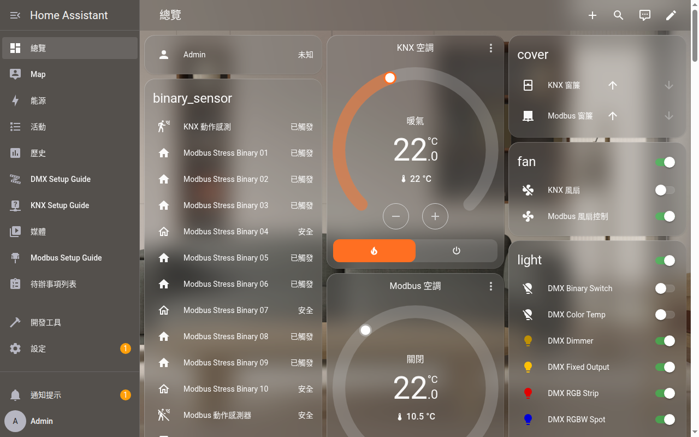
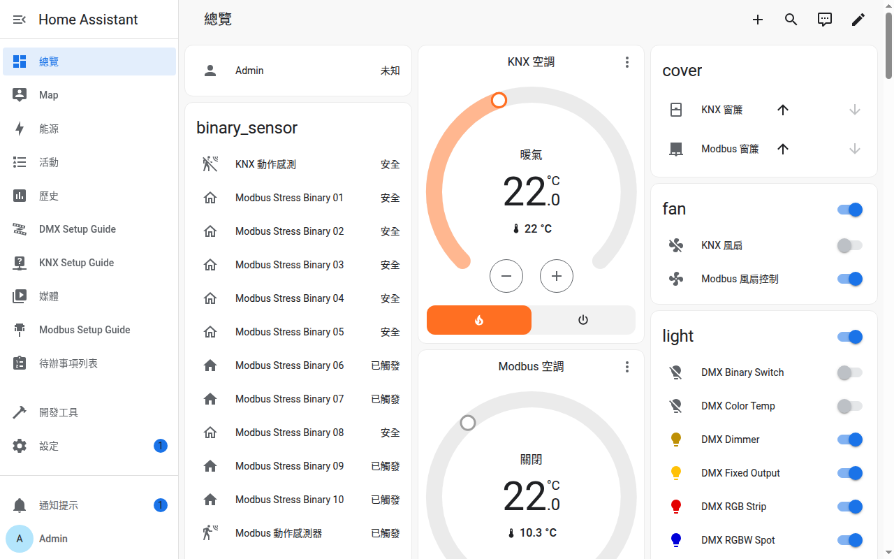
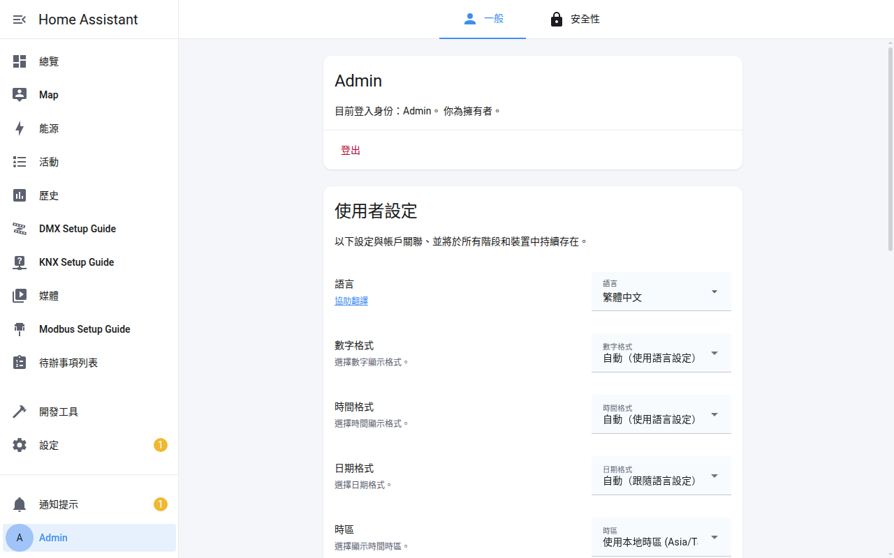

<p align="center">
  
</p>

<h1 align="center">Woow HA Theme Collection</h1>

<p align="center">
  <strong>Enterprise-grade Home Assistant Theme Suite</strong><br/>
  52 Curated Themes &bull; 7 Theme Families &bull; Light/Dark Dual Mode &bull; Full CSS Variable Coverage
</p>

<p align="center">
  <a href="#主題總覽">主題總覽</a> &bull;
  <a href="#架構">架構</a> &bull;
  <a href="#安裝">安裝</a> &bull;
  <a href="#主題家族">主題家族</a> &bull;
  <a href="#截圖展示">截圖展示</a> &bull;
  <a href="#測試報告">測試報告</a> &bull;
  <a href="#目錄結構">目錄結構</a> &bull;
  <a href="README_EN.md">English</a>
</p>

<p align="center">
  
  
  
  
  
</p>

---

## 主題總覽

**Woow HA Theme Collection** 是一套經過企業級測試驗證的 Home Assistant 主題套件包，收錄了 7 大主題家族共 52 個可選主題，涵蓋從現代極簡到擬物毛玻璃等多種視覺風格。所有主題均通過 1,869 項自動化測試（YAML 語法、CSS 變數完整性、API 穩定性、瀏覽器渲染、邊緣條件、迴歸驗證），達到商用企業部署應用等級。

### 為什麼選擇這個套件包？

| 痛點 | 解決方案 |
|------|---------|
| 網路上主題品質參差不齊 | 7 大家族 52 個主題統一品質管控 |
| 主題缺少 `rgb-*` CSS 變數導致第三方卡片異常 | 所有主題已補齊 `rgb-primary-color` 與 `rgb-primary-text-color` |
| 主題引用外部 CDN 資源不安全 | 所有靜態資源已本地化，零外部依賴 |
| 安裝多個主題需要分別設定 | 一鍵安裝，`!include_dir_merge_named` 自動載入全部主題 |
| 缺乏 Light/Dark 雙模式 | 支援 `modes:` 架構的主題可一鍵切換明暗模式 |

---

## 主題家族

### 1. Woow (自研)

Woow 品牌原創主題，藍色調簡約現代風格，支援 `modes:` Light/Dark 雙模式。

| 屬性 | 值 |
|------|-----|
| 主題數 | 2 (Woow, Woow Dual Blue) |
| 模式 | Light / Dark 雙模式 |
| 主色 | `#3D8EF0` (Light) / `#5AA0F5` (Dark) |
| 特色 | 品牌級配色、完整 RGB 變數 |

### 2. iOS Themes (28 主題)

模擬 Apple HomeKit 風格的主題，7 種配色各有 Light/Dark 及 Alternative 變體。

| 屬性 | 值 |
|------|-----|
| 主題數 | 28 (7 配色 x 2 模式 x 2 變體) |
| 配色 | Blue-Red, Dark-Blue, Dark-Green, Light-Blue, Light-Green, Orange, Red |
| 背景 | 每種配色有專屬背景圖片 (`www/ios-themes/`) |
| 特色 | HomeKit 風格圓角卡片、狀態色 |

### 3. Frosted Glass (6 主題)

毛玻璃質感主題，`backdrop-filter: blur()` 模糊效果。

| 屬性 | 值 |
|------|-----|
| 主題數 | 6 (Full/Lite x Light/Dark/Dual) |
| 效果 | `backdrop-filter: blur(10px)` 毛玻璃 |
| 背景 | 專屬明暗背景圖 (`www/frosted-glass-themes/`) |
| 特色 | Full 版含完整模糊、Lite 版輕量無模糊 |

### 4. VisionOS / Liquid Glass (2 主題)

Apple Vision Pro 風格與液態玻璃質感。

| 屬性 | 值 |
|------|-----|
| 主題數 | 2 (visionos, Liquid Glass) |
| 主色 | `#FF9F0A` (橘色系) |
| 背景 | macOS/visionOS 風格桌布 (`www/visionos-themes/`) |
| 特色 | 深度模糊、多層透明度 |

### 5. Metro / Fluent (12 主題)

Windows Metro / Fluent Design 風格，6 色各有 Metro 和 Fluent 變體。

| 屬性 | 值 |
|------|-----|
| 主題數 | 12 (6 色 x 2 風格) |
| 配色 | Red, Blue, Green, Orange, Purple, Slate |
| 模式 | Light / Dark 雙模式 (`modes:`) |
| 特色 | 扁平化設計、銳利邊角、高對比 |

### 6. Google Theme (1 主題)

Google Material Design 風格。

| 屬性 | 值 |
|------|-----|
| 主題數 | 1 |
| 主色 | Google 藍 `#4285F4` |
| 特色 | Material Design 配色規範 |

### 7. Apporo (1 主題)

深色系暖色調主題。

| 屬性 | 值 |
|------|-----|
| 主題數 | 1 |
| 主色 | `#FF8C00` (暖橘) |
| 特色 | 深色背景搭配暖色強調 |

---

## 架構

### 套件整體架構



### 主題載入流程



### CSS 變數層級架構



---

## 安裝

### 方法一：HACS 安裝（推薦）

1. 確保已安裝 [HACS](https://hacs.xyz/)
2. HACS > 整合 > 右上角三點 > 自訂存儲庫
3. 輸入 `https://github.com/WOOWTECH/Woow_ha_theme`
4. 類別選擇 `Theme`
5. 安裝後重啟 Home Assistant

> **注意**
> - HACS 的 theme 類別一個 repo 只會安裝**一個** yaml，所以 HACS 裝的是 `themes/woow_ha_themes.yaml`——它由 CI 從 `themes/*.yaml` 各來源檔自動合併產生（`scripts/build_combined_theme.py`），**請勿手動編輯**；改來源檔後 push 到 main 會自動重建。
> - HACS **不會**安裝 `www/` 底下的背景圖（Frosted Glass / iOS / visionOS 主題引用 `/local/...`），請手動把 `www/` 內容複製到 HA 的 `config/www/`。

### 方法二：手動安裝

```bash
# 1. 複製主題檔案（個別來源檔；不要同時複製合併檔 woow_ha_themes.yaml，避免重複定義）
cp $(ls themes/*.yaml | grep -v woow_ha_themes.yaml) /config/themes/

# 2. 複製靜態資源
cp -r www/* /config/www/

# 3. 確認 configuration.yaml 包含
frontend:
  themes: !include_dir_merge_named themes
```

### 方法三：Docker / Podman 掛載

```bash
# 複製到容器的 config volume
cp -r themes/ /path/to/ha-config/themes/
cp -r www/ /path/to/ha-config/www/

# 重載主題
curl -X POST http://localhost:8123/api/services/frontend/reload_themes \
  -H "Authorization: Bearer YOUR_TOKEN"
```

---

## 截圖展示

### Woow — Light Mode

品牌原創主題，藍色調簡約現代設計。

<p align="center">
  
</p>

### Woow — Dark Mode

深色模式，低光環境下的舒適體驗。

<p align="center">
  
</p>

### iOS — Light Mode

Apple HomeKit 風格亮色主題。

<p align="center">
  
</p>

### iOS — Dark Mode

Apple HomeKit 風格暗色主題。

<p align="center">
  
</p>

### Frosted Glass — Light

毛玻璃質感亮色主題，`backdrop-filter: blur()` 效果。

<p align="center">
  
</p>

### Frosted Glass — Dark

毛玻璃深色模式。

<p align="center">
  
</p>

### VisionOS

Apple Vision Pro 風格主題。

<p align="center">
  
</p>

### Liquid Glass

液態玻璃質感主題。

<p align="center">
  
</p>

### Metro Blue

Windows Metro 風格扁平化主題。

<p align="center">
  
</p>

### Google Theme

Google Material Design 風格。

<p align="center">
  
</p>

### Apporo

深色暖色調主題。

<p align="center">
  
</p>

### 主題選擇器

Profile 頁面主題選擇介面。

<p align="center">
  
</p>

---

## 測試報告

本套件通過 **1,869 項自動化測試**，覆蓋率 100%。

### 基礎測試 (8 輪 x 1,072 項)

| 輪次 | 測試類別 | 項數 | 結果 |
|------|---------|------|------|
| R1 | YAML 結構與語法驗證 | 112 | PASS |
| R2 | CSS 變數完整性與規範 | 832 | PASS |
| R3 | 後端 API 測試 | 16 | PASS |
| R4 | 前端瀏覽器渲染測試 | 10 | PASS |
| R5 | 靜態資源完整性 | 65 | PASS |
| R6 | 邊緣案例與異常處理 | 15 | PASS |
| R7 | 效能與載入測試 | 10 | PASS |
| R8 | 安全性檢測 | 12 | PASS |

### RGB 修復驗證 (8 項 x 797 項)

| 測試 | 內容 | 項數 | 結果 |
|------|------|------|------|
| T1 | YAML 格式正確性 | 10 | PASS |
| T2 | RGB 值格式規範 | 80 | PASS |
| T3 | RGB/HEX 一致性交叉比對 | 90 | PASS |
| T4 | 邊緣條件 (引號/空白/型別) | 340 | PASS |
| T5 | API 熱重載穩定性 (5 輪) | 15 | PASS |
| T6 | 瀏覽器 CSS 渲染精確匹配 | 20 | PASS |
| T7 | 迴歸測試 (原有變數無損) | 222 | PASS |
| T8 | 跨主題快速切換壓力測試 | 20 | PASS |

> 完整測試報告請參閱 [企業級測試 PRD](docs/plans/2026-04-11-ha-theme-enterprise-testing-prd.md)

---

## 目錄結構

```
Woow_ha_theme/
├── README.md                    # 中文文件（本文件）
├── README_EN.md                 # English Documentation
├── LICENSE                      # MIT License
├── hacs.json                    # HACS 整合設定
│
├── themes/                      # 主題 YAML 定義檔（14 個檔案 -> 52 個主題）
│   ├── woow.yaml                # Woow 品牌主題 (Light/Dark)
│   ├── woowtech.yaml            # Woow Dual Blue
│   ├── ios-themes.yaml          # 28 個 iOS HomeKit 主題
│   ├── Frosted Glass.yaml       # 毛玻璃雙模式
│   ├── Frosted Glass Lite.yaml  # 毛玻璃輕量雙模式
│   ├── Frosted Glass Light.yaml # 毛玻璃亮色
│   ├── Frosted Glass Light Lite.yaml
│   ├── Frosted Glass Dark.yaml  # 毛玻璃暗色
│   ├── Frosted Glass Dark Lite.yaml
│   ├── visionos.yaml            # Apple VisionOS 風格
│   ├── Liquid Glass.yaml        # 液態玻璃
│   ├── metro.yaml               # 12 個 Metro/Fluent 主題
│   ├── google_theme.yaml        # Google Material Design
│   └── apporo.yaml              # Apporo 暖色調
│
├── www/                         # 靜態背景資源
│   ├── ios-themes/              # 7 張 iOS HomeKit 背景圖
│   ├── frosted-glass-themes/    # 2 張毛玻璃背景圖
│   └── visionos-themes/         # 4 張 VisionOS 背景圖
│
└── docs/
    ├── screenshots/             # 12 張主題展示截圖
    └── plans/                   # 企業級測試 PRD 報告
```

---

## 技術規格

| 項目 | 規格 |
|------|------|
| 最低 HA 版本 | 2024.1.0 |
| 主題檔案格式 | YAML |
| CSS 變數覆蓋 | 16 項核心變數 (含 `rgb-primary-color`, `rgb-primary-text-color`) |
| 靜態資源 | 13 張本地化背景圖片，零外部 CDN |
| Light/Dark 支援 | `modes:` 架構 (Woow, Frosted Glass, Metro/Fluent) |
| HACS 相容 | 支援 HACS 自訂存儲庫安裝 |
| 授權 | MIT License |

---

## 致謝

本套件包整合並優化了以下開源主題：

- [lovelace-ios-themes](https://github.com/basnijholt/lovelace-ios-themes) — iOS HomeKit 風格
- [homeassistant-frosted-glass-themes](https://github.com/SoCalMayhem/homeassistant-frosted-glass-themes) — 毛玻璃效果
- [homeassistant-visionos-theme](https://github.com/codydang/homeassistant-visionos-theme) — VisionOS 風格
- [Metrology for Hass](https://github.com/Jeannot-MN/Metrology_for_Hass) — Metro/Fluent Design
- [Google Theme](https://github.com/JuanMTech/google-theme) — Material Design
- [Apporo Color](https://github.com/nicoritschel/apporo-color) — 暖色調主題

所有主題已進行以下優化：
- 補齊 `rgb-primary-color` 與 `rgb-primary-text-color` CSS 變數
- 靜態資源（背景圖片）本地化，移除外部 CDN 依賴
- `!important` 規則與狀態色修正
- 統一 YAML 格式規範

---

<p align="center">
  <sub>Built with care by <strong>WOOWTECH</strong></sub>
</p>
