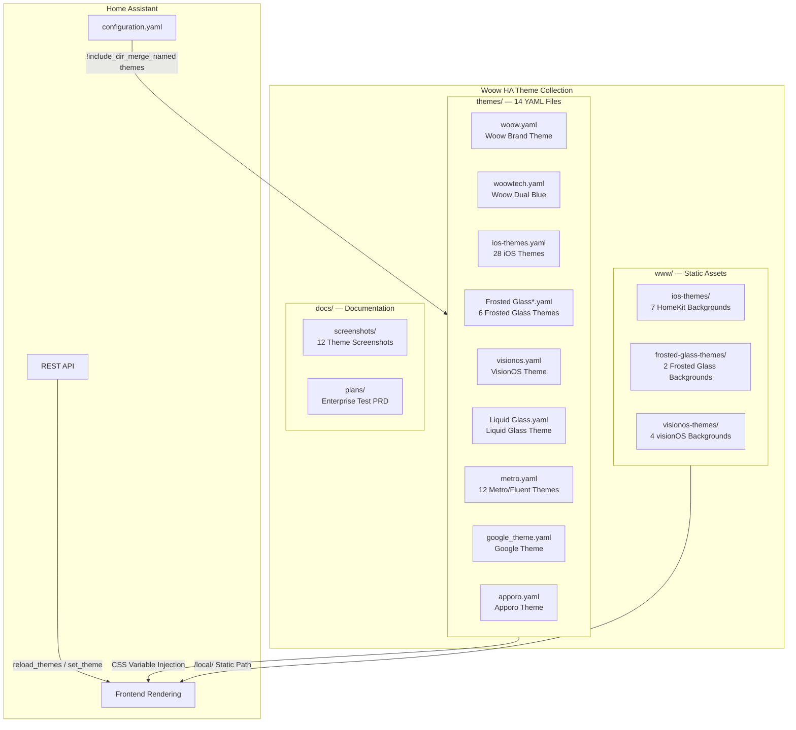
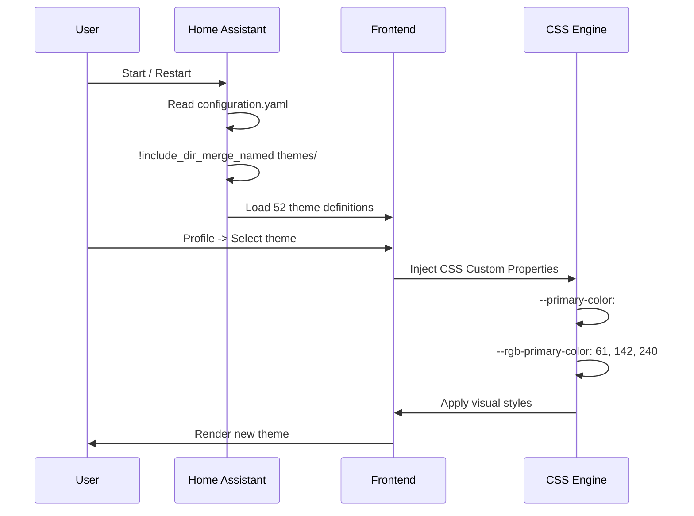
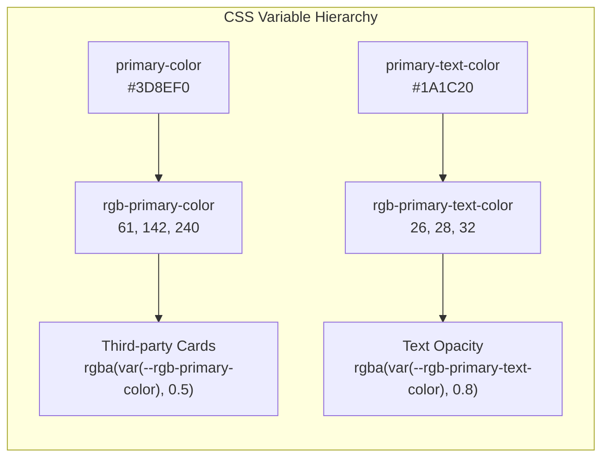

<p align="center">
  
</p>

<h1 align="center">Woow HA Theme Collection</h1>

<p align="center">
  <strong>Enterprise-grade Home Assistant Theme Suite</strong><br/>
  52 Curated Themes &bull; 7 Theme Families &bull; Light/Dark Dual Mode &bull; Full CSS Variable Coverage
</p>

<p align="center">
  <a href="#overview">Overview</a> &bull;
  <a href="#architecture">Architecture</a> &bull;
  <a href="#installation">Installation</a> &bull;
  <a href="#theme-families">Theme Families</a> &bull;
  <a href="#screenshots">Screenshots</a> &bull;
  <a href="#test-report">Test Report</a> &bull;
  <a href="#directory-structure">Structure</a> &bull;
  <a href="README.md">中文文件</a>
</p>

<p align="center">
  
  
  
  
  
</p>

---

## Overview

**Woow HA Theme Collection** is an enterprise-tested Home Assistant theme suite featuring 7 theme families with 52 selectable themes. It covers a wide range of visual styles from modern minimalism to frosted glass skeuomorphism. Every theme has passed 1,869 automated tests (YAML validation, CSS variable completeness, API stability, browser rendering, edge cases, and regression checks), meeting commercial enterprise deployment standards.

### Why This Suite?

| Pain Point | Solution |
|------------|----------|
| Inconsistent quality across community themes | 7 families, 52 themes under unified quality control |
| Missing `rgb-*` CSS variables break third-party cards | All themes ship with `rgb-primary-color` and `rgb-primary-text-color` |
| External CDN dependencies are a security risk | All static assets localized, zero external dependencies |
| Installing multiple themes requires separate setup | One-click install, `!include_dir_merge_named` auto-loads everything |
| No Light/Dark dual mode support | `modes:` architecture themes switch with one click |

---

## Theme Families

### 1. Woow (Original)

WOOWTECH original brand theme with a clean blue-toned modern design. Supports `modes:` Light/Dark dual mode.

| Property | Value |
|----------|-------|
| Themes | 2 (Woow, Woow Dual Blue) |
| Modes | Light / Dark dual mode |
| Primary | `#3D8EF0` (Light) / `#5AA0F5` (Dark) |
| Features | Brand-grade palette, full RGB variables |

### 2. iOS Themes (28 themes)

Apple HomeKit-style themes with 7 color schemes, each having Light/Dark and Alternative variants.

| Property | Value |
|----------|-------|
| Themes | 28 (7 colors x 2 modes x 2 variants) |
| Colors | Blue-Red, Dark-Blue, Dark-Green, Light-Blue, Light-Green, Orange, Red |
| Backgrounds | Dedicated wallpaper per color (`www/ios-themes/`) |
| Features | HomeKit-style rounded cards, status colors |

### 3. Frosted Glass (6 themes)

Frosted glass texture themes with `backdrop-filter: blur()` effects.

| Property | Value |
|----------|-------|
| Themes | 6 (Full/Lite x Light/Dark/Dual) |
| Effect | `backdrop-filter: blur(10px)` frosted glass |
| Backgrounds | Light/dark wallpapers (`www/frosted-glass-themes/`) |
| Features | Full version with blur, Lite version lightweight |

### 4. VisionOS / Liquid Glass (2 themes)

Apple Vision Pro style and liquid glass texture.

| Property | Value |
|----------|-------|
| Themes | 2 (visionos, Liquid Glass) |
| Primary | `#FF9F0A` (orange) |
| Backgrounds | macOS/visionOS wallpapers (`www/visionos-themes/`) |
| Features | Deep blur, multi-layer transparency |

### 5. Metro / Fluent (12 themes)

Windows Metro / Fluent Design style, 6 colors each with Metro and Fluent variants.

| Property | Value |
|----------|-------|
| Themes | 12 (6 colors x 2 styles) |
| Colors | Red, Blue, Green, Orange, Purple, Slate |
| Modes | Light / Dark dual mode (`modes:`) |
| Features | Flat design, sharp edges, high contrast |

### 6. Google Theme (1 theme)

Google Material Design style.

| Property | Value |
|----------|-------|
| Themes | 1 |
| Primary | Google Blue `#4285F4` |
| Features | Material Design color specification |

### 7. Apporo (1 theme)

Dark theme with warm accent colors.

| Property | Value |
|----------|-------|
| Themes | 1 |
| Primary | `#FF8C00` (warm orange) |
| Features | Dark background with warm accents |

---

## Architecture

### Suite Architecture



### Theme Loading Flow



### CSS Variable Hierarchy



---

## Installation

### Option 1: HACS (Recommended)

1. Ensure [HACS](https://hacs.xyz/) is installed
2. HACS > Integrations > Three-dot menu > Custom repositories
3. Enter `https://github.com/WOOWTECH/Woow_ha_theme`
4. Select category `Theme`
5. Install and restart Home Assistant

### Option 2: Manual Installation

```bash
# 1. Copy theme files
cp themes/*.yaml /config/themes/

# 2. Copy static assets
cp -r www/* /config/www/

# 3. Ensure configuration.yaml includes
frontend:
  themes: !include_dir_merge_named themes
```

### Option 3: Docker / Podman

```bash
# Copy to container config volume
cp -r themes/ /path/to/ha-config/themes/
cp -r www/ /path/to/ha-config/www/

# Reload themes
curl -X POST http://localhost:8123/api/services/frontend/reload_themes \
  -H "Authorization: Bearer YOUR_TOKEN"
```

---

## Screenshots

### Woow — Light Mode

Original brand theme with clean blue-toned modern design.

<p align="center">
  
</p>

### Woow — Dark Mode

Dark mode for comfortable viewing in low-light environments.

<p align="center">
  
</p>

### iOS — Light Mode

Apple HomeKit-style light theme.

<p align="center">
  
</p>

### iOS — Dark Mode

Apple HomeKit-style dark theme.

<p align="center">
  
</p>

### Frosted Glass — Light

Frosted glass texture with `backdrop-filter: blur()` effect.

<p align="center">
  
</p>

### Frosted Glass — Dark

Frosted glass dark mode.

<p align="center">
  
</p>

### VisionOS

Apple Vision Pro-style theme.

<p align="center">
  
</p>

### Liquid Glass

Liquid glass texture theme.

<p align="center">
  
</p>

### Metro Blue

Windows Metro flat design theme.

<p align="center">
  
</p>

### Google Theme

Google Material Design style.

<p align="center">
  
</p>

### Apporo

Dark warm-toned theme.

<p align="center">
  
</p>

### Theme Selector

Profile page theme selection interface.

<p align="center">
  
</p>

---

## Test Report

This suite has passed **1,869 automated tests** with 100% pass rate.

### Foundation Tests (8 Rounds x 1,072 Items)

| Round | Category | Items | Result |
|-------|----------|-------|--------|
| R1 | YAML Structure & Syntax Validation | 112 | PASS |
| R2 | CSS Variable Completeness & Spec | 832 | PASS |
| R3 | Backend API Tests | 16 | PASS |
| R4 | Frontend Browser Rendering | 10 | PASS |
| R5 | Static Asset Integrity | 65 | PASS |
| R6 | Edge Cases & Exception Handling | 15 | PASS |
| R7 | Performance & Load Testing | 10 | PASS |
| R8 | Security Audit | 12 | PASS |

### RGB Fix Validation (8 Tests x 797 Items)

| Test | Content | Items | Result |
|------|---------|-------|--------|
| T1 | YAML Format Correctness | 10 | PASS |
| T2 | RGB Value Format Spec | 80 | PASS |
| T3 | RGB/HEX Cross-Validation | 90 | PASS |
| T4 | Edge Cases (quotes/whitespace/type) | 340 | PASS |
| T5 | API Hot-Reload Stability (5 rounds) | 15 | PASS |
| T6 | Browser CSS Rendering Exact Match | 20 | PASS |
| T7 | Regression (existing vars intact) | 222 | PASS |
| T8 | Rapid Cross-Theme Switching Stress | 20 | PASS |

> Full test report: [Enterprise Testing PRD](docs/plans/2026-04-11-ha-theme-enterprise-testing-prd.md)

---

## Directory Structure

```
Woow_ha_theme/
├── README.md                    # Chinese Documentation
├── README_EN.md                 # English Documentation (this file)
├── LICENSE                      # MIT License
├── hacs.json                    # HACS Integration Config
│
├── themes/                      # Theme YAML Definitions (14 files -> 52 themes)
│   ├── woow.yaml                # Woow Brand Theme (Light/Dark)
│   ├── woowtech.yaml            # Woow Dual Blue
│   ├── ios-themes.yaml          # 28 iOS HomeKit Themes
│   ├── Frosted Glass.yaml       # Frosted Glass Dual Mode
│   ├── Frosted Glass Lite.yaml  # Frosted Glass Lite Dual Mode
│   ├── Frosted Glass Light.yaml # Frosted Glass Light Only
│   ├── Frosted Glass Light Lite.yaml
│   ├── Frosted Glass Dark.yaml  # Frosted Glass Dark Only
│   ├── Frosted Glass Dark Lite.yaml
│   ├── visionos.yaml            # Apple VisionOS Style
│   ├── Liquid Glass.yaml        # Liquid Glass
│   ├── metro.yaml               # 12 Metro/Fluent Themes
│   ├── google_theme.yaml        # Google Material Design
│   └── apporo.yaml              # Apporo Warm Tone
│
├── www/                         # Static Background Assets
│   ├── ios-themes/              # 7 iOS HomeKit Background Images
│   ├── frosted-glass-themes/    # 2 Frosted Glass Background Images
│   └── visionos-themes/         # 4 VisionOS Background Images
│
└── docs/
    ├── screenshots/             # 12 Theme Showcase Screenshots
    └── plans/                   # Enterprise Testing PRD Report
```

---

## Technical Specifications

| Item | Specification |
|------|--------------|
| Min HA Version | 2024.1.0 |
| Theme Format | YAML |
| CSS Variables | 16 core variables (incl. `rgb-primary-color`, `rgb-primary-text-color`) |
| Static Assets | 13 localized background images, zero external CDN |
| Light/Dark | `modes:` architecture (Woow, Frosted Glass, Metro/Fluent) |
| HACS | Custom repository installation supported |
| License | MIT License |

---

## Credits

This suite integrates and enhances the following open-source themes:

- [lovelace-ios-themes](https://github.com/basnijholt/lovelace-ios-themes) — iOS HomeKit style
- [homeassistant-frosted-glass-themes](https://github.com/SoCalMayhem/homeassistant-frosted-glass-themes) — Frosted glass effects
- [homeassistant-visionos-theme](https://github.com/codydang/homeassistant-visionos-theme) — VisionOS style
- [Metrology for Hass](https://github.com/Jeannot-MN/Metrology_for_Hass) — Metro/Fluent Design
- [Google Theme](https://github.com/JuanMTech/google-theme) — Material Design
- [Apporo Color](https://github.com/nicoritschel/apporo-color) — Warm-toned theme

All themes have been optimized with:
- Added `rgb-primary-color` and `rgb-primary-text-color` CSS variables
- Localized static assets (background images), removed external CDN dependencies
- Fixed `!important` rules and status colors
- Unified YAML formatting standards

---

<p align="center">
  <sub>Built with care by <strong>WOOWTECH</strong></sub>
</p>
